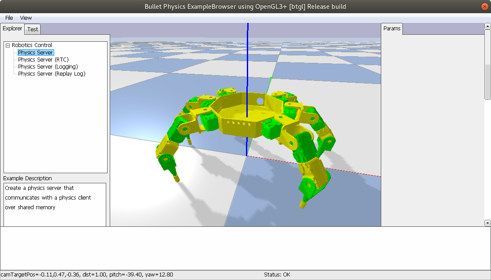

# Kraby the Hexapod -- Robot description files

SDFormat description of Kraby the hexapod.
It can be used to simulate the robot in Gazebo or BulletPhysics.



## Compute inertial parameters with MeshLab

For 3D-printed parts, you may use MeshLab to compute the SDF Link inertia.

Refer to [Gazebo documentation on how to compute inertia parameters](http://gazebosim.org/tutorials?tut=inertia&cat=build_robot).

See also script <doc/compute_inertia.py>.

## Running simulations

### with Gazebo

Install Gazebo, then

```bash
gazebo hexapod.sdf -u --verbose
```

### with PyBullet

See `simulation_demo.py`.

An OpenAI Gym environment is WIP.

## License

This project is under GNU General Public License v3.0 because we believe in
open development. Please see LICENSE file for more details.
